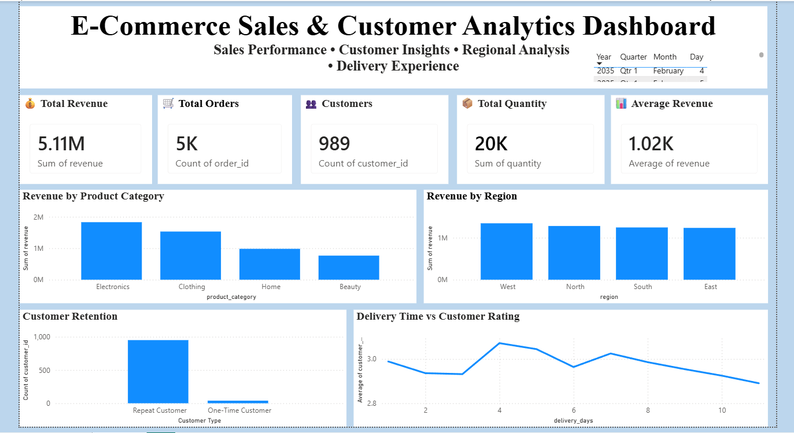

# 📊 E-Commerce Sales & Customer Analytics

An interactive **Power BI dashboard** designed to analyze e-commerce sales performance, customer behavior, product categories, regional performance, and delivery experience.

## 🎯 Project Objective

The objective of this project is to transform raw e-commerce transaction data into meaningful business insights using **PostgreSQL, SQL, and Power BI**.

The dashboard helps analyze:

- Overall sales performance
- Product category performance
- Regional revenue distribution
- Customer retention
- Delivery performance
- Customer ratings
- Key business KPIs

## 🛠️ Tools & Technologies

- **PostgreSQL** – Data storage and database management
- **SQL** – Data analysis and business queries
- **Power BI** – Interactive dashboard and data visualization
- **Git & GitHub** – Version control and project management

## 📈 Key Business KPIs

| KPI | Value |
|---|---:|
| Total Revenue | ₹5,109,775.74 |
| Total Orders | 5,000 |
| Total Customers | 989 |
| Total Units Sold | 20,224 |
| Average Order Value | ₹1,021.96 |

## 🛍️ Product Category Analysis

The dashboard analyzes sales performance across different product categories, including:

- Electronics
- Clothing
- Home
- Beauty

The analysis helps compare revenue, order volume, and quantity sold across product categories.

## 🌍 Regional Analysis

Sales performance is analyzed across different regions:

- West
- North
- South
- East

The dashboard provides a comparison of revenue, orders, and quantity sold across regions.

## 👥 Customer Analysis

The project analyzes customer purchasing behavior and retention.

Customers are categorized based on their purchasing activity to understand:

- Repeat customers
- One-time customers
- Customer contribution to revenue
- Overall customer retention

## 🚚 Delivery & Customer Experience

The dashboard analyzes the relationship between:

- Delivery days
- Customer ratings
- Orders
- Revenue

This helps understand delivery performance and its relationship with customer experience.

## 📊 Power BI Dashboard

The interactive dashboard includes:

- **Total Revenue**
- **Total Orders**
- **Total Customers**
- **Total Units Sold**
- **Average Order Value**
- **Revenue by Product Category**
- **Revenue by Region**
- **Customer Retention Analysis**
- **Delivery Time vs Customer Rating**

The dashboard uses a clean, light-blue themed interface to provide an easy-to-understand view of business performance.

## 🔍 Key Insights

- The business generated more than **₹5.1 million** in total revenue.
- The dataset contains **5,000 orders** from **989 customers**.
- A total of **20,224 units** were sold.
- The average order value is approximately **₹1,021.96**.
- Customer retention can be analyzed by comparing repeat and one-time customers.
- Product category performance can be compared based on revenue and order volume.
- Regional performance can be evaluated using revenue, orders, and quantity sold.
- Delivery days and customer ratings can be analyzed together to understand customer experience.

## 📁 Project Structure

```text
E-Commerce-Sales-Customer-Analytics/
│
├── README.md
│
├── data/
│   └── ecommerce_sales_analytics_5000.csv
│
├── sql/
│   └── SQL queries
│
├── screenshots/
│   └── dashboard.png
│
└── E-Commerce-Sales-Analytics.pbix
## 🖼️ Dashboard Preview

